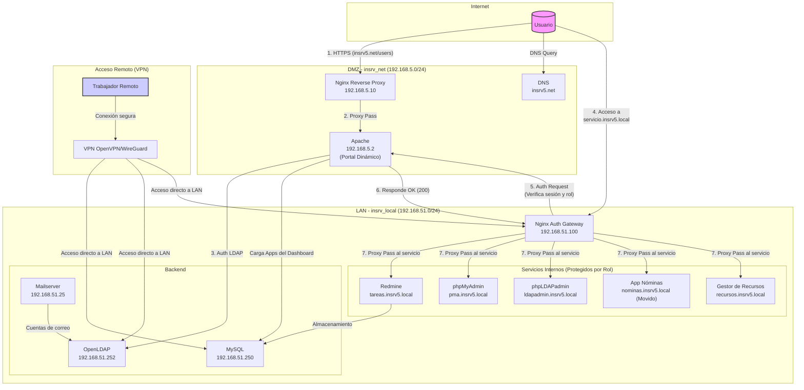

# 🚀 Infraestructura de Servicios IT con Docker

Proyecto de 2º de ASIR para simular una infraestructura TI empresarial completa utilizando contenedores Docker. El objetivo es desplegar, gestionar y securizar servicios de red, autenticación, bases de datos y aplicaciones internas.

**Estado del proyecto:** ✅ **Versión 2.0 - Funcional, Dinámico y Modular.** La arquitectura principal ha sido refactorizada para incluir un dashboard de aplicaciones dinámico gestionado por administradores desde la UI, un sistema de SSO robusto y un nuevo módulo de RRHH (Nóminas).

---

## 📋 Descripción del proyecto

Este proyecto replica un entorno corporativo mediante la orquestación de múltiples servicios con Docker. La arquitectura está segmentada en dos redes principales para simular una **zona desmilitarizada (DMZ)** y una **red de área local (LAN)**, garantizando que los servicios críticos no estén expuestos directamente a Internet.

El sistema incluye:

- **Portal de Empleados Dinámico:** Un dashboard con autenticación centralizada (OpenLDAP) y Single Sign-On (SSO). Las aplicaciones mostradas se cargan desde una base de datos y son **completamente gestionables (CRUD) por administradores** directamente desde la interfaz.
- **Servicios web públicos y privados** con Nginx como reverse proxy y gateway de autenticación.
- **Control de Acceso Basado en Roles (RBAC)** para proteger aplicaciones internas como Redmine, phpMyAdmin o el nuevo **Módulo de Nóminas**.
- **Bases de datos** para aplicaciones internas (MySQL).
- **Herramientas de gestión web** para LDAP y MySQL (phpLDAPadmin, phpMyAdmin).
- **Servidor de correo** integrado con LDAP.
- **Sistema de gestión de proyectos** (Redmine).
- **Resolución de nombres DNS** para los dominios `insrv5.net` (público) y `insrv5.local` (interno).

---

## 🧱 Arquitectura de Red

La infraestructura se divide en dos redes aisladas para mejorar la seguridad:

| Red           | Subred            | Propósito                                                                              |
| ------------- | ----------------- | -------------------------------------------------------------------------------------- |
| `insrv_net`   | `192.168.5.0/24`  | **DMZ (Zona Desmilitarizada):** Expone servicios al exterior (Nginx, DNS, Portal Web). |
| `insrv_local` | `192.168.51.0/24` | **LAN (Red Interna):** Aloja servicios críticos (LDAP, BBDD, Redmine, Mail).           |

### 📐 Esquema de Arquitectura

---

## ⚙️ Descripción de Servicios

| Servicio              | Imagen                            | IP (insrv_local) | IP (insrv_net)  | Rol y Descripción                                                                                                                                                                                                                                                                                                |
| :-------------------- | :-------------------------------- | :--------------- | :-------------- | :--------------------------------------------------------------------------------------------------------------------------------------------------------------------------------------------------------------------------------------------------------------------------------------------------------------- |
| **dns**               | `ubuntu/bind9`                    | `192.168.51.253` | `192.168.5.253` | Servidor DNS. Resuelve nombres de dominio para ambas redes: `.local` para la LAN interna y `.net` para la DMZ externa, esencial para la comunicación entre servicios.                                                                                                                                            |
| **openldap**          | `osixia/openldap`                 | `192.168.51.252` | -               | Servidor de autenticación centralizada para todos los servicios que lo requieran. Configurado con LDAPS para comunicación segura y gestión declarativa de la configuración y cuentas de servicio.                                                                                                                |
| **phpldapadmin**      | `osixia/phpldapadmin`             | `192.168.51.4`   | -               | Interfaz web para la administración de OpenLDAP, facilitando la gestión de usuarios, grupos y estructuras de directorio. Accesible internamente vía Nginx (`ldapadmin.insrv5.local`).                                                                                                                            |
| **db**                | `mysql`                           | `192.168.51.250` | -               | Base de datos MySQL robusta para todas las aplicaciones internas, incluyendo Redmine, el Portal de Empleados y el Módulo de Nóminas.                                                                                                                                                                             |
| **phpmyadmin**        | `phpmyadmin`                      | `192.168.51.3`   | -               | Interfaz web para la administración de bases de datos MySQL, permitiendo gestionar tablas, consultas y usuarios de forma sencilla. Acceso interno vía Nginx (`pma.insrv5.local`).                                                                                                                                |
| **nginx**             | `nginx`                           | `192.168.51.100` | `192.168.5.10`  | **Reverse Proxy principal y Gateway de Autenticación**. Dirige el tráfico, gestiona certificados SSL/TLS, actúa como balanceador de carga y protege los servicios internos aplicando Control de Acceso Basado en Roles (RBAC) y validación de sesiones. También expone el endpoint `/stub_status` para métricas. |
| **apache**            | (Build local)                     | `192.168.51.2`   | `192.168.5.2`   | **Servidor del Portal de Empleados**. Implementa el sistema de login, el dashboard dinámico de aplicaciones, el SSO, la API de gestión de apps (CRUD) y el sistema de `auth_request` para la validación de roles y sesiones con Nginx.                                                                           |
| **mailserver**        | `mailserver/docker-mailserver`    | `192.168.51.25`  | -               | Servidor de correo electrónico completo (SMTP, IMAP). Integrado con OpenLDAP para la gestión de cuentas de usuario, permitiendo a los empleados tener buzones de correo funcionales dentro de la red.                                                                                                            |
| **redmine**           | `redmine`                         | `192.168.51.10`  | -               | Plataforma de gestión de proyectos y seguimiento de tareas. Accesible internamente a través de Nginx (`tareas.insrv5.local`), protegida por RBAC.                                                                                                                                                                |
| **nominas**           | (Parte de `apache`)               | `192.168.51.2`   | -               | Módulo de gestión de Nóminas. Accesible en `nominas.insrv5.local` y protegido con RBAC, requiriendo roles específicos (RRHH, Admin) para su acceso. Se encuentra dentro de la aplicación Apache en `/apps/nominas/`.                                                                                             |
| **recursos**          | (Build local)                     | `192.168.51.2`   | -               | Gestor de Recursos. Accesible en `recursos.insrv5.local` y protegido por rol. Permite la subida, descarga y gestión de documentos con control de versiones y permisos, esencial para el almacenamiento centralizado de la documentación corporativa.                                                             |
| **prometheus**        | `prom/prometheus`                 | `192.168.51.40`  | -               | Sistema de monitorización y alerta. Recopila métricas de diversos servicios (Nginx, MySQL, cAdvisor, Blackbox Exporter) para ofrecer una visión completa del estado de la infraestructura.                                                                                                                       |
| **alertmanager**      | `prom/alertmanager`               | `192.168.51.52`  | -               | Componente de Prometheus que gestiona y envía alertas basadas en las reglas definidas. Centraliza la notificación de incidentes y problemas en el sistema.                                                                                                                                                       |
| **blackbox-exporter** | `prom/blackbox-exporter`          | `192.168.51.41`  | -               | Exportador de Prometheus que permite sondear endpoints HTTP, HTTPS, DNS, TCP e ICMP para verificar la disponibilidad y latencia de los servicios desde la perspectiva de la red.                                                                                                                                 |
| **cadvisor**          | `gcr.io/cadvisor/cadvisor`        | `192.168.51.42`  | -               | Herramienta que recopila y expone métricas de rendimiento y uso de recursos (CPU, memoria, disco, red) de los contenedores en ejecución en el host Docker.                                                                                                                                                       |
| **mysqld-exporter**   | `prom/mysqld-exporter`            | `192.168.51.43`  | -               | Exportador de Prometheus para MySQL. Recopila métricas detalladas del servidor de base de datos, incluyendo rendimiento de consultas, conexiones y uso de recursos.                                                                                                                                              |
| **nginx-exporter**    | `nginx/nginx-prometheus-exporter` | `192.168.51.44`  | -               | Exportador de Prometheus para Nginx. Recopila métricas de tráfico, conexiones y peticiones del servidor web Nginx.                                                                                                                                                                                               |
| **grafana**           | `grafana/grafana`                 | `192.168.51.45`  | -               | Plataforma de visualización y análisis de datos. Se conecta a Prometheus y Loki para crear dashboards interactivos y alertas visuales sobre el estado y rendimiento de la infraestructura.                                                                                                                       |
| **loki**              | `grafana/loki`                    | `192.168.51.50`  | -               | Sistema de agregación de logs diseñado para ser altamente eficiente y escalable. Funciona de manera similar a Prometheus, pero para logs en lugar de métricas.                                                                                                                                                   |
| **promtail**          | `grafana/promtail`                | `192.168.51.51`  | -               | Agente de Loki. Se encarga de recolectar logs de los contenedores Docker y enviarlos a Loki para su almacenamiento centralizado y posterior consulta.                                                                                                                                                            |
| **vpn**               | `ghcr.io/wg-easy/wg-easy`         | `192.168.51.20`  | `192.168.5.20`  | Servidor WireGuard para la creación de una Red Privada Virtual (VPN). Permite a usuarios externos acceder de forma segura a la red `insrv_local`, habilitando el acceso remoto a servicios internos protegidos.                                                                                                  |
| **portainer**         | `portainer/portainer-ce`          | `192.168.51.5`   | -               | Interfaz de usuario gráfica para la gestión de entornos Docker. Facilita la administración de contenedores, imágenes, volúmenes y redes.                                                                                                                                                                         |
| **backup-manager**    | `docker:cli`                      | `192.168.51.60`  | -               | Contenedor encargado de la gestión de copias de seguridad y restauración. Ejecuta scripts personalizados para realizar backups automáticos (cron) y manuales de bases de datos, LDAP y volúmenes persistentes, así como la restauración de los mismos.                                                           |

---

## 📊 Monitorización y Observabilidad

La infraestructura cuenta con un robusto sistema de monitorización y gestión de logs basado en el stack Grafana-Prometheus-Loki-Alertmanager.

- **Prometheus:** Recopila métricas en tiempo real de todos los servicios. Se configura para extraer datos de:
  - **Nginx:** A través de `nginx-exporter` y su endpoint `/stub_status`.
  - **MySQL:** Mediante `mysqld-exporter`.
  - **Contenedores Docker:** Con `cAdvisor`, que monitoriza el uso de CPU, memoria, red y disco de todos los contenedores.
  - **Disponibilidad de servicios:** Usando `blackbox-exporter` para sondear la accesibilidad de endpoints HTTP, DNS y TCP.
- **Alertmanager:** Gestiona las alertas generadas por Prometheus, permitiendo la configuración de reglas para notificaciones automáticas en caso de incidencias.
- **Grafana:** Plataforma de visualización que se integra con Prometheus para mostrar dashboards interactivos y con Loki para la exploración de logs. Incluye dashboards preconfigurados para Docker, Nginx, MySQL y el sistema general.
- **Loki:** Agregador de logs a escala horizontal, optimizado para la indexación de metadatos de logs en lugar de los logs completos, lo que lo hace muy eficiente.
- **Promtail:** Agente de Loki que se ejecuta en cada host para recolectar logs de los contenedores y enviarlos a Loki.

---

## 🌐 Acceso Remoto Seguro (VPN)

Se ha implementado un servidor WireGuard (`wg-easy`) para proporcionar acceso seguro a la red `insrv_local` desde ubicaciones externas. Esto permite a los trabajadores remotos conectarse a los servicios internos protegidos por RBAC como si estuvieran dentro de la LAN, garantizando la confidencialidad e integridad de la comunicación.

- **Servicio:** `vpn` (basado en `ghcr.io/wg-easy/wg-easy`)
- **Funcionalidad:** Servidor WireGuard con interfaz web de gestión para generar fácilmente configuraciones de clientes VPN.
- **Beneficios:** Acceso seguro y cifrado a la red interna (`192.168.51.0/24`) y DMZ (`192.168.5.0/24`), fundamental para cumplir con los requisitos de seguridad de acceso remoto para ciertas aplicaciones.

---

## 🐳 Gestión de Contenedores (Portainer)

Para facilitar la administración visual del entorno Docker, se ha integrado Portainer.

- **Servicio:** `portainer` (basado en `portainer/portainer-ce`)
- **Funcionalidad:** Proporciona una interfaz gráfica de usuario (GUI) para gestionar contenedores, imágenes, volúmenes, redes y mucho más, simplificando las operaciones diarias de Docker.
- **Acceso:** Disponible en la red `insrv_local`.

---

## 💾 Sistema de Backups

Se ha establecido un sistema de copias de seguridad robusto para proteger los datos críticos de la infraestructura.

- **Servicio:** `backup-manager` (utiliza la CLI de Docker)
- **Funcionalidad:**
  - **Backups automáticos:** Configurado con `cron` para realizar copias de seguridad diarias a las 03:00 AM de:
    - Bases de datos MySQL.
    - Directorio OpenLDAP.
    - Volúmenes persistentes de Grafana, VPN, Redmine (archivos adjuntos) y Mailserver.
  - **Backups y Restauraciones Manuales:** Incluye un mecanismo para disparar copias de seguridad específicas o restaurar bases de datos (MySQL, LDAP) y volúmenes (Grafana, VPN, Redmine, Mailserver) bajo demanda, mediante la creación de archivos de señalización en el volumen compartido `./backups`.
  - **Gestión de Archivos:** Permite eliminar archivos de backup específicos.
- **Almacenamiento:** Los backups se guardan en el volumen local `backups/`, mapeado desde el host.

---

## 🔐 Flujo de Funcionamiento y Seguridad

### Flujo de Autenticación y Single Sign-On (SSO)

1. Un usuario accede a `https://insrv5.net` y es dirigido al portal de empleados (`/users/index.php`).
2. El portal de Apache valida las credenciales (usuario o email) contra el servidor OpenLDAP de forma segura (LDAPS).
3. Si la autenticación es correcta, se crea una sesión para el dominio `.insrv5.local` y se almacena el `uid` y el rol del usuario.
4. Se redirige al usuario al **dashboard dinámico**. El portal consulta la base de datos MySQL para obtener las aplicaciones a las que el usuario tiene acceso según su rol y las muestra como tarjetas interactivas.
5. Los **administradores (rol IT)** verán controles adicionales en el dashboard para añadir, editar o eliminar aplicaciones, gestionando así lo que el resto de empleados puede ver.
6. Desde el dashboard, el usuario puede hacer clic para acceder a servicios como `app.insrv5.local`. El sistema de SSO utiliza la sesión ya creada para darle acceso sin volver a pedirle credenciales.

### Acceso a Servicios Internos con RBAC

1. Cuando un usuario intenta acceder a un servicio interno (ej. `https://nominas.insrv5.local`), la petición es interceptada por el **Nginx Auth Gateway** en la LAN (`192.168.51.100`).
2. Nginx congela la petición y realiza una `auth_request` interna al portal de Apache, preguntando: _"¿Tiene este usuario (identificado por su cookie de sesión) alguno de los roles requeridos (ej. 'RRHH' o 'Administracion') para este recurso y cumple con los requisitos de conexión (ej. VPN)?"_
3. Apache verifica la sesión y el rol del usuario, y responde a Nginx con un código `200 OK` (si está autorizado), `403 Forbidden` (si no) o un `401 Not Authorized` (si no ha iniciado sesión).
4. Si la respuesta es `200`, Nginx permite el acceso y redirige la petición al servicio final. Si es `403`, muestra una página de acceso denegado.

### Medidas de Seguridad

- **Segmentación de red (DMZ/LAN):** Los servicios críticos no tienen exposición directa a Internet.
- **Reverse Proxy (Nginx):** Actúa como único punto de entrada, ocultando la topología de la red interna y centralizando la gestión de SSL.
- **Control de Acceso Basado en Roles (RBAC):** Nginx, en combinación con el portal de empleados, protege cada servicio interno, asegurando que solo usuarios con los privilegios adecuados puedan acceder.
- **Single Sign-On (SSO):** Mejora la experiencia de usuario y la seguridad al centralizar el punto de login.
- **Comunicación cifrada:** Se utilizan certificados SSL/TLS para el acceso web (HTTPS) y para los servicios LDAP (LDAPS).
- **Acceso restringido por IP y VPN:** Las configuraciones de Nginx y el dashboard verifican si el usuario proviene de una red interna o VPN. Algunas aplicaciones requieren explícitamente conexión VPN para su acceso (`requiere_vpn`).
- **Autenticación Centralizada:** OpenLDAP gestiona todos los usuarios y grupos, evitando credenciales dispersas.

---

## 🔮 Próximos Pasos (Roadmap)

- [x] **Integración de VPN:** Desplegar un contenedor (ej. `wireguard`) para permitir el acceso remoto seguro a la red `insrv_local`.
- [x] **Sistema de Backups:** Implementar un servicio de copias de seguridad automáticas para la base de datos MySQL y los datos de OpenLDAP.
- [x] **Monitorización y Logs:** Centralizar los logs de todos los contenedores y desplegar herramientas de monitorización (como Prometheus/Grafana).
- [x] **Desarrollo del Portal de Empleados:** Finalizado. El portal ahora es un sistema dinámico con dashboard, SSO y gestión de aplicaciones vía API/Base de Datos.
